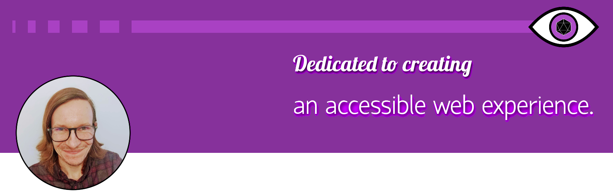

  
<h2 align="center">My name is Eric (he/him). N-eyes to meet you! :eyeglasses:</h2>

I'm a Software Engineer with a focus on accessibility. As someone with an eye disease, having accessible features can be a huge deal for me. Understanding how certain features affect others with impairments or disabilties is something I am constantly researching and wanting to expand my knowledge of. My goal with any project I create is to make it as accessible as possible.

The great thing about learning more and more about accessibility is that not once have I ever felt like I wasn't doing enough, or that I had to cater to every accessibility feature out there immediately. I understand that I am learning and growing, and I'll know more tomorrow than I do today. A particular quote that I think more people should understand about making things more accessible, especially if they're just starting to do so:

> "Just try and fix something. One thing, two things, another thing tomorrow. And if you can do that, then trust me, you'll be making a difference for somebody out there."
>
>  — [Léonie Watson, *Front-Trends 2015*](https://www.youtube.com/watch?v=qdB8SRhqvFc&t=1418s)

 

Beyond my personal goal of learning about (and helping others better understand) accessibility, I also work for Red Hat on their [Patternfly](https://www.patternfly.org/v4/) team, and am a maintainer for the [The Odin Project](https://www.theodinproject.com/). 

---

### Future Plans...

- Expand my back-end knowledge to evolve from strictly front-end work.
- Continue making contributions to The Odin Project, and look for other open source contribution opportunities.
- Checkoff some of the personal project ideas on my to-do list, including a D&D character builder for homebrew settings.

---

### Outside of Coding...

When I'm not coding, I most enjoy flexing my creative muscles by playing in and running D&D campaigns. :game_die:

For the campaign that I run, I took bits and pieces of a homebrew to design my own set of homebrew rules, which proved to be a lengthy process (2+ years to get the rules in a playable state). Collaborating with friends/players to create something together, built from the ground up by nothing but our imaginations, and having endless possibilities... I guess learning to become a web developer was only :game_die: natural. :game_die:

---

  

  

